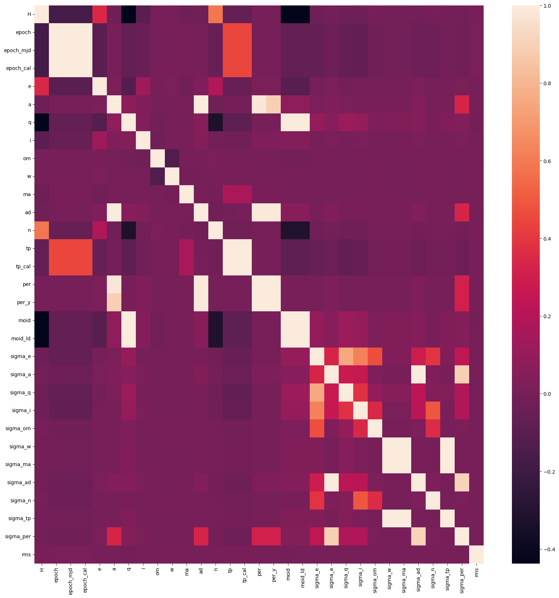
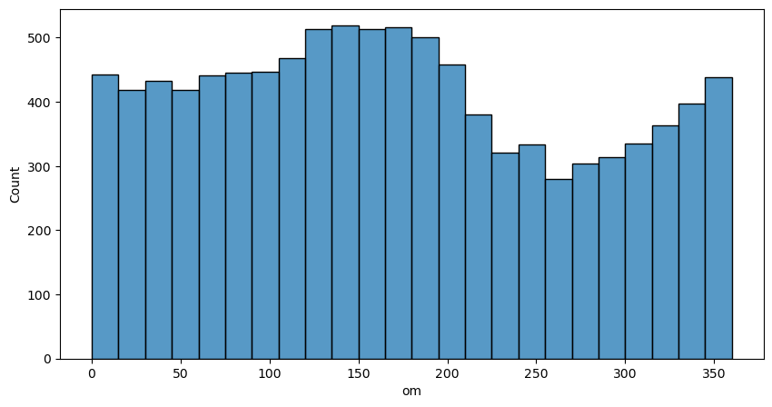
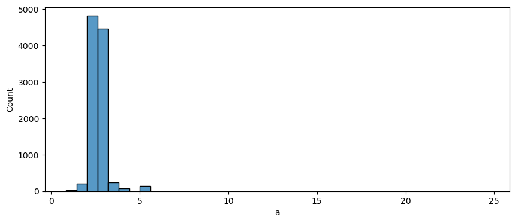
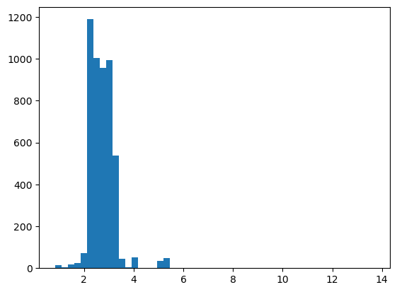
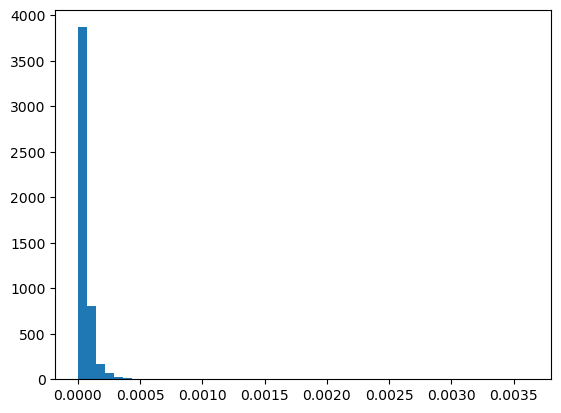
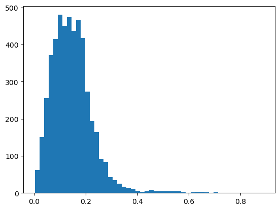
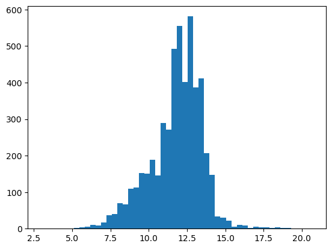
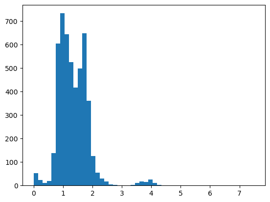
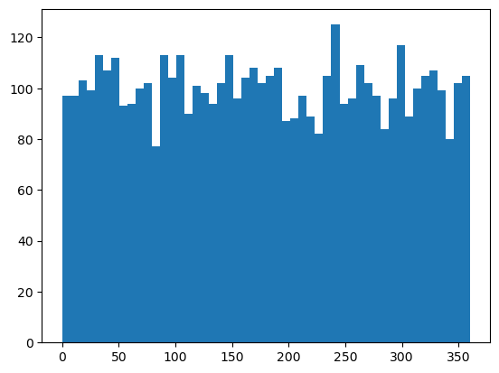
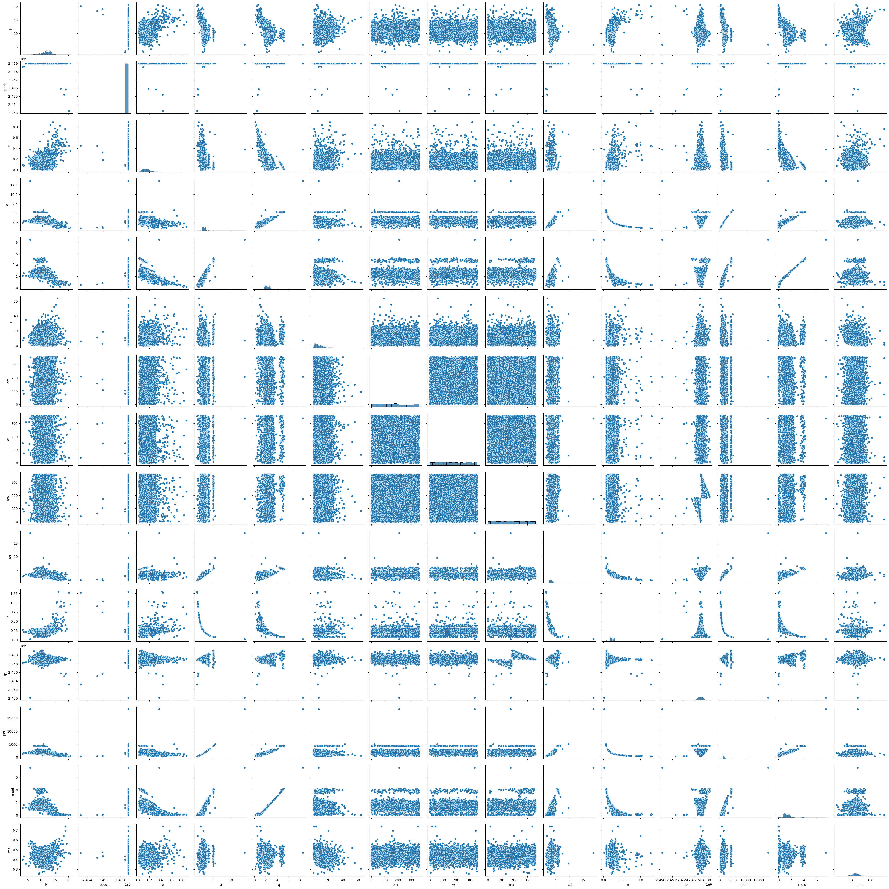

<h1 style="text-align: center;">Análise Exploratória</h1>

Table:

1. View geral do dataset
2. Correlations
3. Plots

---

No final do artigo anterior ficamos com o dataset no seguinte formato.

<table>
<tr><th> n x p shape </th><th> Imbalanced Classes  </th></tr>
<tr><td>

| n       | p   |
| ------- | --- |
| 958_524 | 39  |
| \*      |

</td><td>

| Class | qtd     |
| ----- | ------- |
| Y     | 958.524 |
| N     | 2066    |

</td></tr> </table>

<h2 style="text-align: left;">Matrix de correlação</h2>

#### Vamos dropar as colunas linearmente dependentes, ficamos nós resta agoraFicamos com

<table>
<tr><th> n x p shape </th><th> Imbalanced Classes  </th></tr>
<tr><td>

| n       | p   |
| ------- | --- |
| 938.598 | 34  |
| \*      |

</td><td>

| Class | qtd     |
| ----- | ------- |
| Y     | 936.532 |
| N     | 2066    |

</td></tr> </table>

## Variavel Resposta com as variaveis de classe

Vemos que asteroids perigosos são apenas de classe AMO, APO, ATE e existem 6 em IEO.
Nota para o futuro: Juntar as classes qeu não tem nenhum asteroide perigoso e testar no novo modelo

## CLASS

| pha\class | AMO  | APO   | AST | ATE  | CEN | HYA | IEO | IMB   | MBA    | MCA   | OMB   | TJN  | TNO  |
| --------- | ---- | ----- | --- | ---- | --- | --- | --- | ----- | ------ | ----- | ----- | ---- | ---- |
| N         | 8338 | 10919 | 75  | 1555 | 504 | 4   | 16  | 19903 | 837430 | 18356 | 27815 | 8160 | 3462 |
| Y         | 118  | 1768  | 0   | 174  | 0   | 0   | 6   | 0     | 0      | 0     | 0     | 0    | 0    |

## NEO

Outra descoberta boa, só temos pha = Y em casos de NEO = 1.

| pha\neo | 0      | 1     |
| ------- | ------ | ----- |
| N       | 915709 | 20828 |
| Y       | 0      | 2066  |

### Quando não temos classe temos 2 tipos de variaveis

| Type               | Intervalo       | Exemple plot                                      |
| ------------------ | --------------- | ------------------------------------------------- |
| Angular (ma, om)   | $[0,360]$       |  |
| Escalar (td resto) | $[-\inf,+\inf]$ |    |

### Top 5000 rows

Separado abaixo estão as melhores variáveis com formatos de curvas para termos uma noção da distribuição dos dados. Vemos que nas distribuições parece que temos muitos pontos saltantes.

| a                                                 | sigma_w                                           | e                                                 |
| ------------------------------------------------- | ------------------------------------------------- | ------------------------------------------------- |
|  |  |  |

| H                                                 | moid                                              | ma                                                |
| ------------------------------------------------- | ------------------------------------------------- | ------------------------------------------------- |
|  |  |  |

## Pairplot

Vemos que temos relações não lineares entre variáveis, que é bom, porem vamos ver como isso vai se resolver pelo modelo.

## Conclusões

Nosso dataset ficou bem limpo e perfeito para aplicarmos qualquer método desejado. Espero que os outliers não deturpem muito o modelo.

Pensando como arvore:
Já sabemos que caso class not in [AMO, APO, ATE, IEO] e neo != 1 já declaramos como não perigoso, caso contrario teremos mais avaliações.
