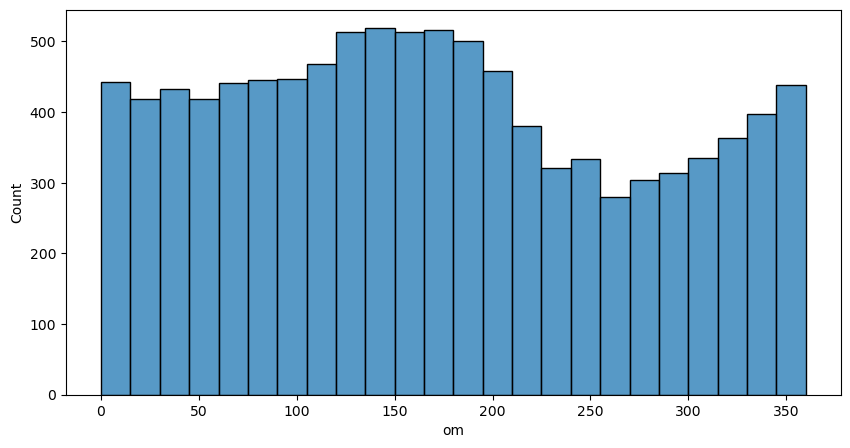

# Análise Exploratória

| n       | p   |
| ------- | --- |
| 958_524 | 39  |

## Class x Tabela

| Class | qtd     |
| ----- | ------- |
| Y     | 958.524 |
| N     | 2066    |

## Matrix de correlação

#### Vamos dropar as colunas linearmente dependentes, ficamos nós resta agoraFicamos com

| Class | qtd     |
| ----- | ------- |
| Y     | 936.532 |
| N     | 2066    |

## Variavel Resposta com as variaveis de classe

Vemos que asteroids perigosos são apenas de classe AMO, APO, ATE e existem 6 em IEO.
Nota para o futuro: Juntar as classes qeu não tem nenhum asteroide perigoso e testar no novo modelo

## CLASS

| pha\class | AMO  | APO   | AST | ATE  | CEN | HYA | IEO | IMB   | MBA    | MCA   | OMB   | TJN  | TNO  |
| --------- | ---- | ----- | --- | ---- | --- | --- | --- | ----- | ------ | ----- | ----- | ---- | ---- |
| N         | 8338 | 10919 | 75  | 1555 | 504 | 4   | 16  | 19903 | 837430 | 18356 | 27815 | 8160 | 3462 |
| Y         | 118  | 1768  | 0   | 174  | 0   | 0   | 6   | 0     | 0      | 0     | 0     | 0    | 0    |

## NEO

Outra descoberta boa, só temos pha = Y em casos de NEO = 1.

| pha\neo | 0      | 1     |
| ------- | ------ | ----- |
| N       | 915709 | 20828 |
| Y       | 0      | 2066  |

## Conclusões pré-modelo

Pensando como arvore:
Já sabemos que caso class not in [AMO, APO, ATE, IEO] e neo != 1 já declaramos como não perigoso, caso contrario teremos mais avaliações.

## Outras variaveis

| Type    | Variaveis | Exemple plot                                     |
| ------- | --------- | ------------------------------------------------ |
| Escalar |           |   |
| Angular |           |  |
